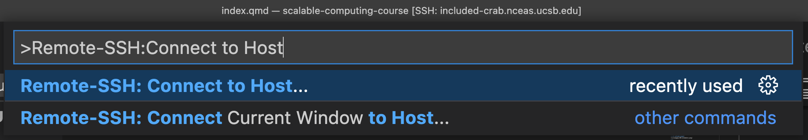

# Various useful accounts

(Probably) everyone:
- [ ]  Get a W&M research computing account! [https://www.wm.edu/offices/it/services/researchcomputing/acctreq/](https://www.wm.edu/offices/it/services/researchcomputing/acctreq/)
- [ ]  [Create a GitHub account](https://github.com/join) if you don’t have one

If doing Earth observation:
- [ ]  Register for Google Earth Engine - [register without a cloud project](https://code.earthengine.google.com/register)
- [ ]  [Register for a Planet Labs education account](https://www.planet.com/markets/education-and-research/#apply-now) (I should be able to hook you up with my grant eventually but start here)

# Using the Big Rig

## Logging in remotely 

## Installing and using WSL 

# HPC resources
## Use VS Code to access HPC

Detailed borrowed from [NCEAS’s Scalable and Reproducible Approaches to Arctic Research course](https://learning.nceas.ucsb.edu/2023-03-arctic/#setting-up) (an excellent resource!)

1. First, [download VS Code](https://code.visualstudio.com/) if you do not already have it installed. You’ll also need to download the [Remote - SSH extension](https://marketplace.visualstudio.com/items?itemName=ms-vscode-remote.vscode-remote-extensionpack).
2. To connect to the server using VS Code follow these steps, from the VS Code window, open the command pallette (Cmd + Shift + P).
3. Enter “Remote SSH: Connect to Host”



1. select “Add New Host”
2. enter the ssh command to connect to the host:

```python
ssh [wm_username]@astral.sciclone.wm.edu
```

For example, you can do `ssh jdelvecchio01@astral.sciclone.wm.edu` if you’re me. You’ll only have to do this step once.

1. Select the SSH config file to update with the name of the host. You should select the one in your user directory (eg: `/Users/jclark/.ssh/config`)
2. Click “Connect” in the popup in the lower right hand corner and then select Linux as the platform (which is astral’s platform, not your computer’s) 
    - Note: If the dialog box does not appear, reopen the command palette (Control+ Shift + P), type in “Remote-SSH: Connect to Host…”, choose e.g. astral.sciclone.wm.edu from the options of configured SSH hosts, then enter your password into the dialog box that appears
3. Enter your password in the dialog box that pops up at the top of the screen. When you are connected, you will see in the lower left hand corner of the window a green bar that says “SSH: astral.sciclone.wm.edu.”


After connecting to the server, in the extensions pane (View > Extensions) search for, and install, (1) Python, (2) Jupyter, and (3) Jupyter Keymap (note that these extensions will be installed on the server, and not locally)

If you ever have an issue finding your Python interpreter within your environment, you might have to add it manually:

1. in VS Code bring up the palette by Ctrl+Shift+P
2. Search “Python: Select Interpreter”
3. Click “Enter interpreter path” and then “Find” to go to your directories
4. From here navigate to .*conda* and then *envs*, where you will find a folder for the environment you want to use
5. Within this environment directory go to *bin* and then scroll down until you find python.11 or whatever the latest version of Python that environment has. Select that. it should work now!

## Set up conda environments on HPC

1. Add two lines to your `.bashrc` file:

```bash
source "/usr/local/anaconda3-2021.05/etc/profile.d/conda.csh"

module load anaconda3
```

1. Open a new terminal (Control + ` on Windows and then the “+” symbol on the terminal tray). Despite adding the line to the `bashrc` file (which means “run this script every time I log on to the terminal), It doesn’t seem to like `module load anaconda3` and I don’t know why. You have to do that in the terminal, I guess. So type `module load anaconda3.`  If no error message emerges, you’re good!

1. Create a test conda environment (And write `y` any time you have to install):

```python
conda create -n test python=3.12
```

1. Activate that test environment with `conda activate test`. `(test)` should now appear in front of the name of the computer you’re on.

## Access GPU nodes on the cluster

### GRAVEL lab instructions

1. Pull up an astral terminal either in Terminal, Command Prompt, or VS Code

2. 2. Submit a request for an interactive GPU node for two hours with one GPU:
    
    `salloc -n 4 -t 2:00:00 --gpus=1`

Note that you can request a time longer than two hours. Also note that if the queue is quite long you may consider [switching to performing your task on the Big Rig](#-Using-the-Big-Rig). 

3. Be sure to activate your environment - any `conda` commands you ran before are not carried over to this new instance

### General instructions from IT

The [**SLURM**](https://www.wm.edu/offices/it/services/researchcomputing/using/jobsslurm/index.php) batch system is used on astral/as01 to run jobs.  The maximum walltime for all jobs on this cluster is 72hrs.  The front-end, astral, has 32 CPU cores available which will be the default node if you require only CPUs.   The GPU node, as01, may be specidied via your command-line options:

To run an interactive job on CPUs only:

`salloc -n 4 -t 1:00:00     # will get you 4 CPU cores`

To request one or more GPUs:

`salloc -n 4 -t 1:00:00 --gpus=2     # will get you 4 CPU cores and 2 GPUs`

The --gpus=N  can be added to your srun command (to run a job directly from the command line) or in your batch script, i.e.:

`#SBATCH --gpus=2`

Currently, there are no reserved slots for debugging.  Please send email to [hpc-help] if you need help obtaining resources on this subcluster.

# Some extra links - Local install

This is really for Joanmarie who was installing VS Code to run locally on Windows. 

[https://onezero.blog/how-to-set-up-python-and-visual-studio-code-ide-for-data-science/](https://onezero.blog/how-to-set-up-python-and-visual-studio-code-ide-for-data-science/)

[https://stackoverflow.com/questions/66869413/visual-studio-code-does-not-detect-virtual-environments](https://stackoverflow.com/questions/66869413/visual-studio-code-does-not-detect-virtual-environments)